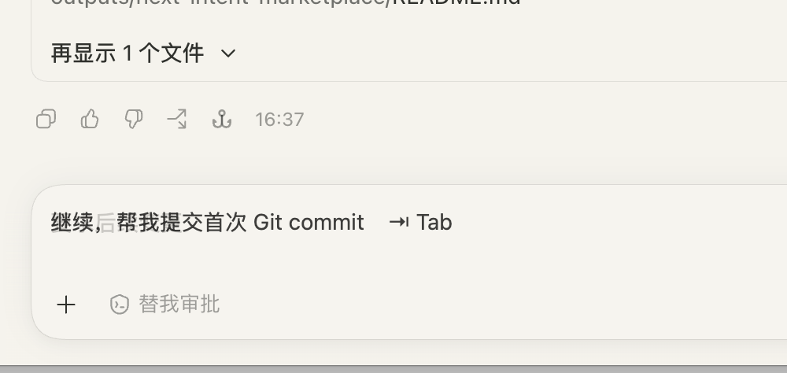

# Next Intent for Codex

Next Intent 是一个实验性的 Codex 插件。每轮 AI 回复结束后，它会调用一个小模型猜测你最可能发送的下一句话，并把建议显示在输入框附近：

> 没问题，继续吧　⇥ Tab

按 `Tab` 接受建议；按 `Esc` 或开始输入其他内容会取消建议。

## 效果预览



## 功能

- 根据最近六条用户/AI 消息生成一句简短补全
- 默认使用 `gpt-5.6-luna`
- 在 Codex 桌面端输入框附近显示灰色浮层
- 按 `Tab` 将建议填入输入框
- 粘贴后恢复原剪贴板内容
- 建议生成在后台运行，不阻塞原任务

## 系统要求

- macOS 13 或更高版本
- Codex/ChatGPT 桌面端
- 当前版本不支持 Windows、Linux 或浏览器版 Codex

如果尚未安装 Command Line Tools：

```bash
xcode-select --install
```

## 从 Git 仓库安装

仓库发布后，可以直接添加 Git marketplace：

```bash
codex plugin marketplace add https://github.com/xiaok/codex-hint-plugin.git
codex plugin add next-intent@next-intent-local
```

也可以先克隆仓库，再从本地目录安装：

```bash
git clone https://github.com/xiaok/codex-hint-plugin.git
codex plugin marketplace add "/path/to/codex-hint"
codex plugin add next-intent@next-intent-local
```

## 从 ZIP 安装

1. 解压 `next-intent-marketplace.zip`。
2. 在终端运行以下命令，把路径替换为实际解压目录：

```bash
codex plugin marketplace add "/path/to/next-intent-marketplace"
codex plugin add next-intent@next-intent-local
```

3. 完全退出并重新打开 Codex/ChatGPT 桌面端。
4. 新建一个 task；插件会在后台编译并启动 **Next Intent Helper**。
5. macOS 提示时，在“系统设置 → 隐私与安全性 → 辅助功能”中开启 **Next Intent Helper**。
6. 开启权限后，重新启动 Codex；部分 macOS 配置还可能要求“输入监控”权限。
7. 由于当前 codex 插件并未开放 input 读写接口，权限仅用于写入粘贴板，不会有任何隐私上传。当 codex 增加 api 后，该插件会立刻更新取消这个权限。请 star 该项目关注后续

## 使用方法

1. 正常向 Codex 提问。
2. 等 AI 回复结束。
3. 自动生成建议，按 `Tab` 接受建议，检查无误后再发送。


## 模型配置

默认模型为：

```text
gpt-5.6-luna
```


## 隐私与用量

- 插件不需要单独的 OpenAI API Key，复用当前 Codex 登录状态。
- 插件不把 transcript 发送给第三方服务。
- 建议和诊断日志保存在本机 Codex 插件数据目录。
- 每轮建议都会产生小额的额外模型用量。

## 故障排查

### 没有显示建议

- 等待 AI 回复结束后再点击空白输入框。
- 在辅助功能设置中确认 **Next Intent Helper** 已开启。
- 开启权限后完全退出并重新打开 Codex。
- 新建一个 task，确保新版 hook 被加载。

### Helper 无法启动

先安装 Command Line Tools：

```bash
xcode-select --install
```

## 卸载

```bash
codex plugin remove next-intent
codex plugin marketplace remove next-intent-local
```
